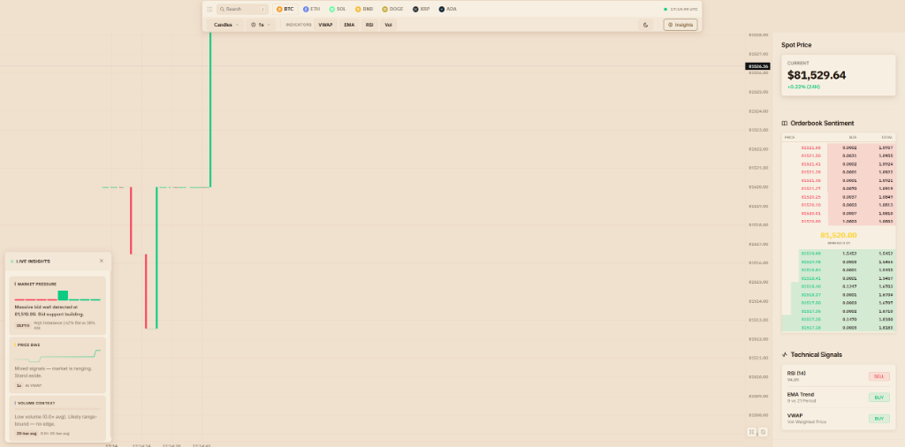
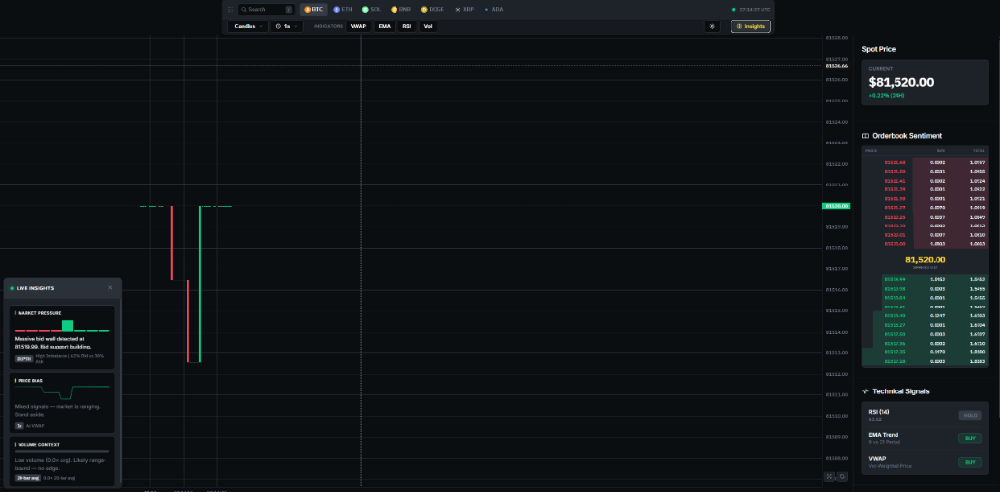

# Pulse Terminal: Crypto Trading Interface

I built Pulse Terminal for my own personal use. I just wanted a clean, focused way to watch the quick `1s` crypto market info without having to manage a hundred different tabs. It hooks straight into Binance's WebSockets and REST APIs to provide real-time data in a single, lightweight view.

## Screenshots

|              Light Mode               |              Dark Mode              |
| :-----------------------------------: | :---------------------------------: |
|  |  |

## [Live Demo ](TBD)

## Key Features

- **Orderbook Depth**: See the real-time bid/ask spread and where the big walls are sitting.
- **Momentum Insights**: Automated logic that tracks volume spikes, RSI levels, and VWAP crossovers.
- **Fast Timeframes**: Supports 1s, 1m, 3m, 5m, 15m, and 30m intervals.
- **Clean Charting**: Built on Lightweight Charts v4.1.1 with custom themes for both light and dark modes.

## Tech Stack

- **Core**: Vanilla HTML5, CSS3, and JavaScript (ES6+).
- **Charting**: Lightweight Charts v4.1.1.
- **Icons**: Iconify Framework.
- **API**: Binance Public WebSocket & REST API.

## Install Steps

Simply open `Terminal-main.html` in any modern browser. No build steps required.

---

_Note: This is a frontend-only terminal. No private keys or trading credentials should be entered here as it is designed for monitoring and Personal use._
